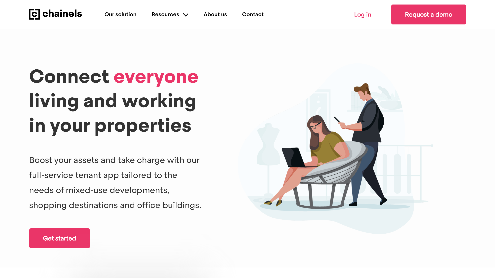
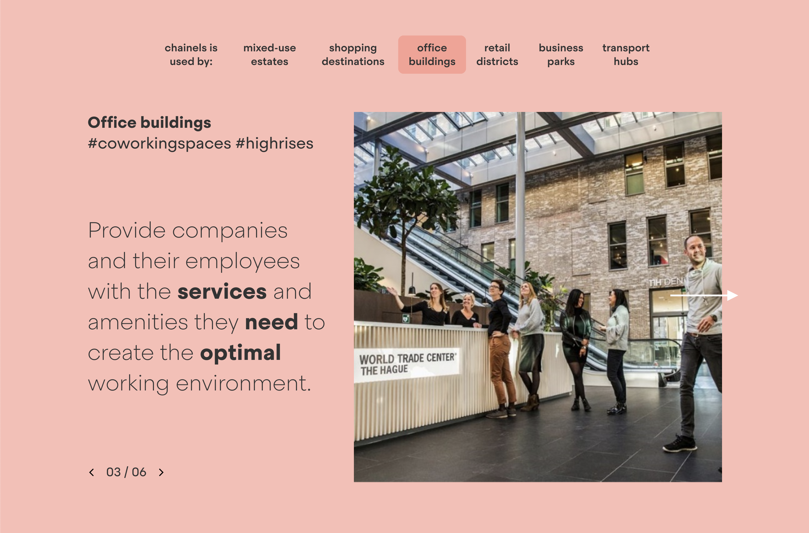
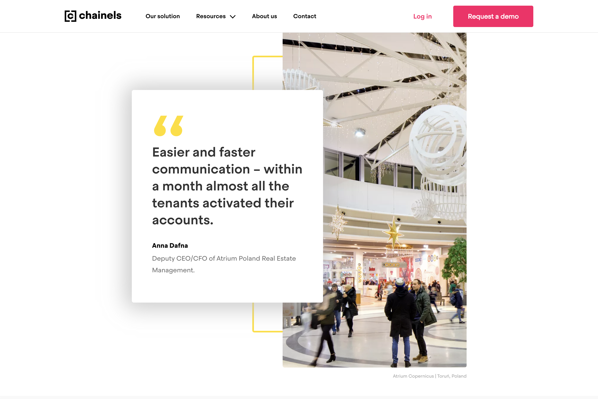

### A fresh look

Working tightly with some of the devs at Chainels, designers and content creators, I was responsible for setting up the first version of Chainels's new homepage.  
I realized this by creating a new iteration on the current set-up we used for the Chainels Consumersites, that works more like the JAMStack. 

<a href="https://chainels.com/home">Visit the site here</a>

  

- React
- Gatsby.js
- React Spring
- WordPress w/ ACF & GraphQL

  

  

