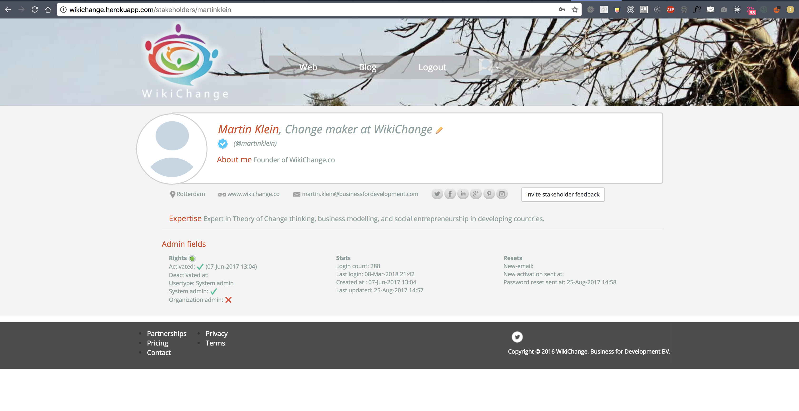
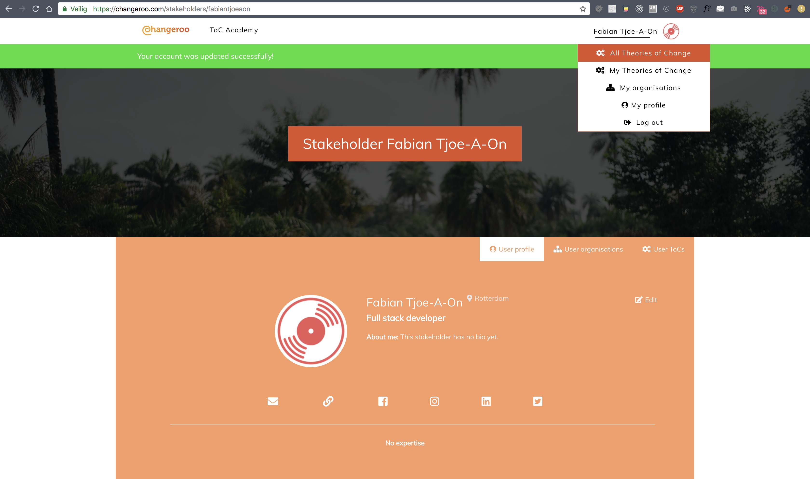
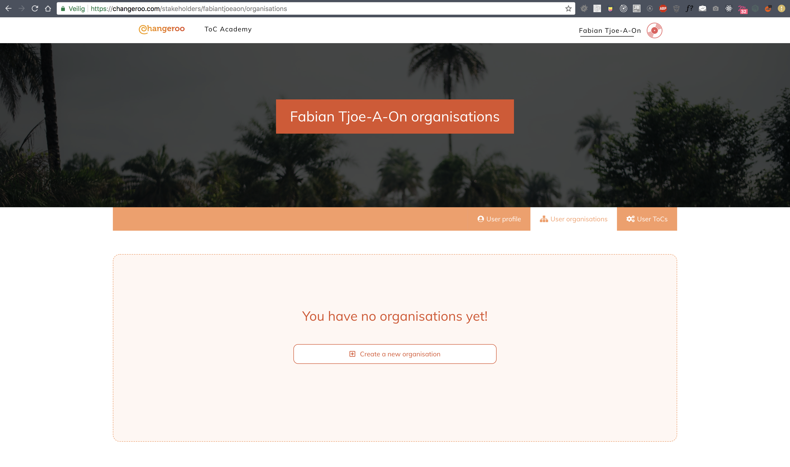

Changeroo was my first mid-sized project, though never worked on a small to medium sized codebase, I decided to take on the challenge to build the first version of the portal of my clients web app. Changeroo is mainly a design and visualisation tool for <a target="_blank" href="https://en.wikipedia.org/wiki/Theory_of_change">Theories of Change</a>.

> "Theory of Change (ToC) is a specific type of methodology for planning, participation, and evaluation that is used in the philanthropy, not-for-profit and government sectors to promote social change. Theory of Change defines long-term goals and then maps backward to identify necessary preconditions."

<iframe src="https://player.vimeo.com/video/229111344" width="100%" height="500" frameborder="0" webkitallowfullscreen mozallowfullscreen allowfullscreen></iframe>

The portal of this web app was decoupled from the web interface that provides the functionality that lets you visualise a Theory of Change, which was build by <a href="https://www.uncinc.nl/en/" target="_blank">Unc Inc</a>, whom I had to work with to manage some functionality.
The portal was my full responsibility, so I had to make most programming design choices by myself, with the help and permission of my client.

Some of the functionalities I had to build include:

- Communication and passing on user roles to the Web Interface through <a href="https://firebase.google.com/">Google Firebase</a>.
- Registration and authentication (both local and with JWT for use with Firebase).
- Managing stakeholders, organisations, and the data that is needed to create a Theory of Change.
- Build the ToC Academy, a page where users could read in on how to use the application, and important papers regarding change. This was achieved using an external Wordpress website as a JSON API, pulling and converting this data in through my back-end, and then caching it with Redis.

- Node.js (w/ Express and Pug)
- SQL (w/ bookshelf ORM)
- Redis

A beta version of the portal had already been build in Ruby on Rails. I have decided to start out with a clean slate because I was not content with the current design.

I am not a designer however, and because a new interface design wasn't really my job, I have decided to freestyle it a bit, falling back onto the current design options when time was of the essence. This is what the current version of the portal looks like:

With ~ 75 routes, I consider this a medium sized project, that I have handed over succesfully to my client, and enjoyed working on. You can visit Changeroo <a href="https://changeroo.com">here</a>.
