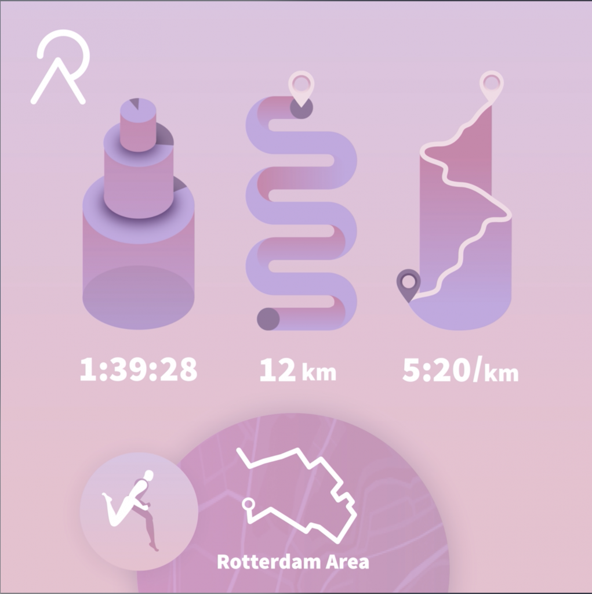

### Shareable interactions

<a href="https://relive.cc" target="_blank">Relive</a> creates 3D videos of your outdoor activities.
By adding pictures, statistics and locations, these videos give a lot of context and meanings to your ride, runs and more. The downside of this being that videos
like these can get very long.  
For my first project during my internship at Relive I worked on Relive Cards, which are a shorter form of videos that highlight the
important statistics of your ride.

  

- React w/ TypeScript
- Canvas w/ PIXI.js
- GSAP

### Motion

After lots of iterations with different motions and easings I prototyped a first version along with the in-house designer, where-as the design
of the card mostly changed during development, where choices were made based on technical findings and possible limitations.   

Afterwards we ended up with a better version compared to the initial design shown above, that gave more context to the individual statistics instead of just being random shapes with linear animations.  This design was stress tested with different forms of activities (hikes, runs, rides), data, and colors.

