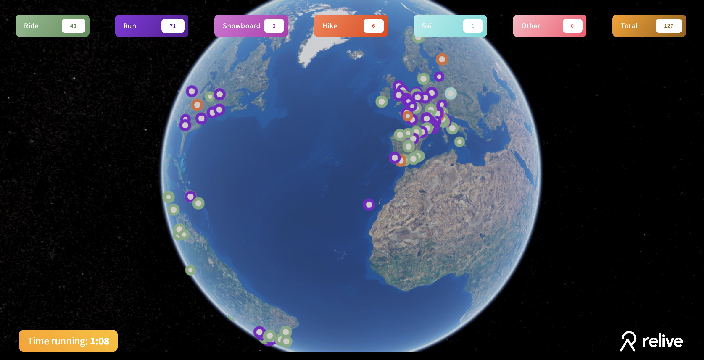

### Office tool

The end of my internship at Relive was focussed on creating a 3D overview that would be displayed in the office, to give people working there an overview
of what <a href="https://relive.cc/">Relive</a> users are currently doing around the globe.

- React w/ TypeScript
- WebGL w/ Cesium.js
- GSAP

### Real time

The Worldview fetched real-time data from Relive's internal API's using web-sockets. This data was then translated back to instances in Cesium,
and animated with GSAP.

Unfortunately due to internal API changes and me not being an intern at Relive anymore the WorldView is not running anymore, nor
did I get the chance to capture some footage.

