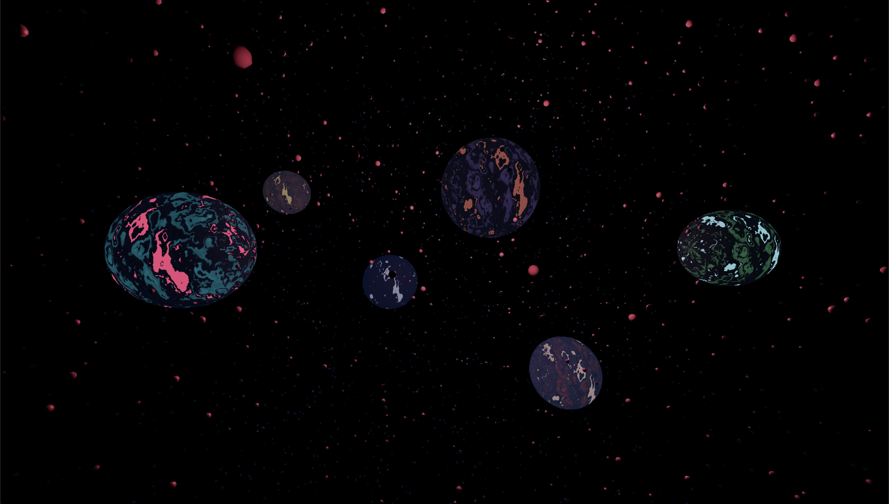
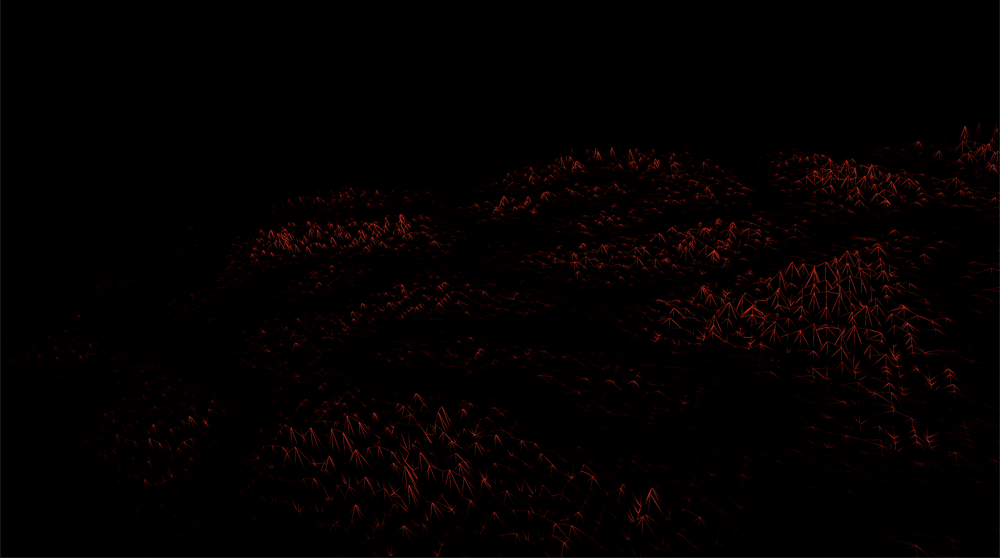
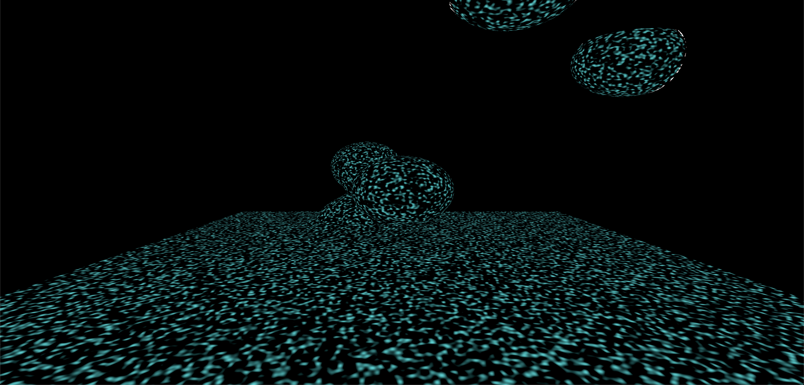
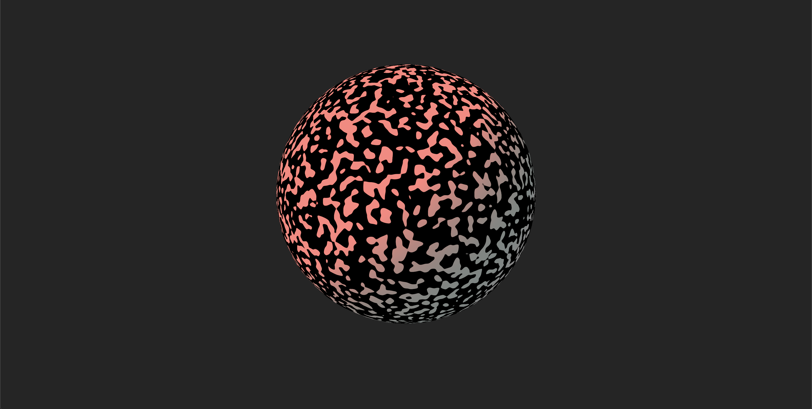

## Planets

Distorted spheres with particles. 

Build with react-three-fiber and custom shaders.

Visit <a href="https://webgl-planets.netlify.app/" target="_blank">here</a>

## Grid

Vertex displacement on a grid using perlin noise. 

Build with regl / custom shaders.

Visit <a href="https://fabiantjoeaon.github.io/grid-vertex-displacement/" target="_blank">here</a>

## 3D image manipulation

Try-out to manipulate images and videos with Gerstner waves on 3D planes.
Desktop only! 

Build with regl / custom shaders.

Visit <a href="https://fabiantjoeaon.github.io/webgl-image-manipulation/" target="_blank">here</a>

<!--

## Meta balls / blobs

<strong>Early work</strong>

Small sketch when I just started out with WebGL that implements a <a target="_blank" href="https://threejs.org/examples/webgl_marchingcubes.html">marching cubes algorithm</a>
together with gravitational pull.

Build with THREE.

Visit <a href="https://fabiantjoeaon.github.io/gravitational-attraction-marching-cubes/" target="_blank">here</a>

## Animated noise

<strong>Early work</strong>

Animated perlin noise on a sphere, first try-out writing shaders

Build with THREE and custom shaders.

Visit <a href="https://fabiantjoeaon.github.io/sphere-perlin-vertex/" target="_blank">here</a>

-->